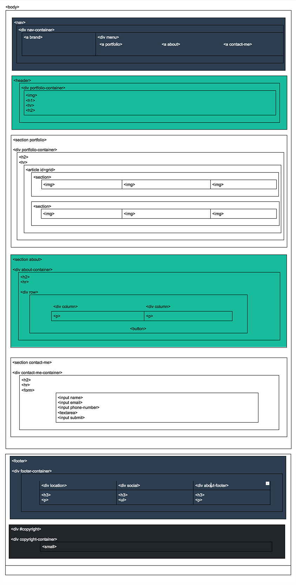

# Freelancer

* **Track:** _Common Core_
* **Curso:** _Creando tu primer sitio web interactivo_
* **Unidad:** _Maquetado web con HTML & CSS_

***

Para completar este reto, cuyo objetivo consistió en replicar el sitio de **Freelancer**, se siguió el siguiente flujo de trabajo.

## Flujo de trabajo

1. Se hizo un **fork** de este repositorio y posteriormente se clonó para tener la posibilidad de modificarlo en local.

2. En el archivo `index.html` se hizo el markup del sitio tomando como base el siguiente Diagrama de Bloques:

3. En el archivo `main.css` se aplicaron los estilos necesarios para obtener la apariencia requerida.

## Objetivo

Replicar el sitio de **Freelancer**, siendo este el resultado
a obtener:

* [Sitio original](https://blackrockdigital.github.io/startbootstrap-freelancer/)
  de referencia.

  > Nota: El sitio original tiene ciertos efectos y funcionalidades que
están fuera del alcance de este reto. Enfócate en obtener la maquetación
lo más parecido posible, usando lo aprendido en clase ;)

## A tener en cuenta

Este reto será evaluado sobre lo siguiente:

* Pixel perfect (replicar el diseño con exactitud)
* Nombramiento de clases, id, etc
* Indentación
* Archivo `README.md` actualizado y correctamente redactado
* Uso de comentarios para hacer tu código más legible
